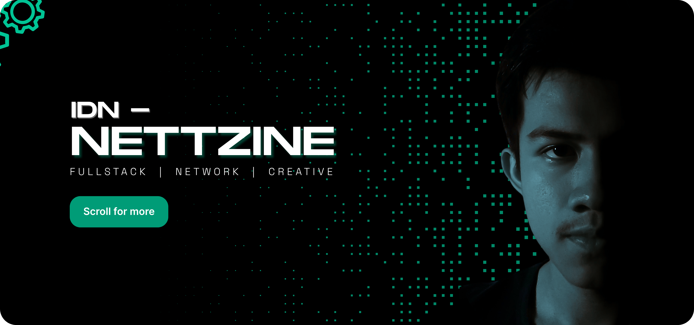

  

<h3 align="center">👋 Aku Rangga 👋</h3>

Berasal dari Indonesia dan aku adalah Tech Enthusiat yang punya minat besar di bidang IT seperti Programming, Cyber Security, Network, Editing, Design UI/UX dan Konten Kreatif Digital. Saat ini aku mengembangkan kemampuan di bidang <b>App Development</b> dan <b>AI</b> sebagai fondasi untuk karier di industri teknologi🔥.

##

### 🚀 Hal yang sudah aku Lakukan :

- **Web Development and Game Development** | Membangun Website dan Game.
- **Cybersecurity & Jaringan** | Mempelajari OSINT, sedikit CTF, Linux dan Mikrotik.
- **Public Speaking** | Di beberapa kesempatan saya sudah menjadi Pembicara.
- **Kreativitas Visual** | Menekuni fotografi, videografi, dan editing sebagai cara menyalurkan ide dan Hobi.

##

### ⚒️ Skills and Tools :

  
  
  
  
  
  
  
  
  
  
  

###

  
  
  
  
  
  
  
  
  
  
  
  
  
  
  
  
  
  
  
  
  
  

###

  
  
  
  
  
  
  
  
  
  
  

##

### 🌐 Connect with me :

  
  
  

##

### 📊 Github Stats :

  <!---->

##

### 🏆 Trophies

---

<picture>
  <source media="(prefers-color-scheme: dark)" srcset="https://raw.githubusercontent.com/Hanif-ID/Hanif-ID/output/pacman-contribution-graph-dark.svg">
  <source media="(prefers-color-scheme: light)" srcset="https://raw.githubusercontent.com/Hanif-ID/Hanif-ID/output/pacman-contribution-graph.svg">
  
</picture>

